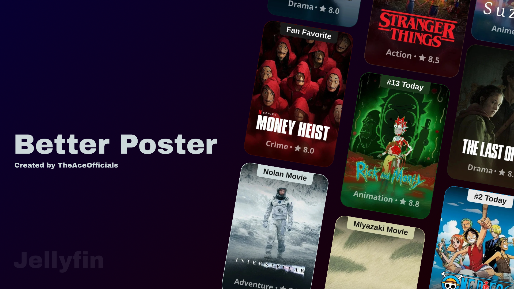

# BetterPosters for Jellyfin

  

**BetterPosters** is an automated metadata and image provider plugin for Jellyfin. It seamlessly integrates with [btttr.cc](https://btttr.cc) to fetch high-quality, premium custom posters for your Movies and TV Shows. These posters feature curated designs with highly customizable overlays, giving your library a polished and modern streaming-service aesthetic.

## ✨ Features

* **Premium Poster Overlays:** Automatically fetches gorgeous, pre-styled posters featuring detailed badges and overlays.
* **Fully Customizable:** Toggle Trend Tags (Trending, New, IMDb #3), Quality Tags (4K, Dolby Vision, Atmos), Genre, Ratings, and Age Ratings (PG-13, TV-MA, R) to your liking.
* **Multiple Rating Sources:** Choose your preferred rating source including Average, IMDb, TMDB, Rotten Tomatoes, Metacritic, Trakt, Letterboxd, and Roger Ebert.
* **18 Languages Supported:** Choose from a wide variety of languages for your poster text and badges (English, Hindi, Japanese, Spanish, French, German, and many more).
* **Smart ID Fallbacks:** Attempts to match using the IMDb ID first. If missing, it automatically falls back to the TMDB ID.
* **Native Integration:** Acts as an official Remote Image Provider. No external scripts or cron jobs required!

---

## 📥 Installation Guide

Installing the plugin is incredibly simple using Jellyfin's built-in plugin repository system.

### Step 1: Add the Repository
1. Open your **Jellyfin Web UI** and log in as an Administrator.
2. Go to **Dashboard** -> **Plugins** (under the Advanced section).
3. Click on the **Repositories** tab at the top.
4. Click the **(+) Add** button and enter the following details:
   * **Repository Name:** BetterPosters
   * **Repository URL:** `https://raw.githubusercontent.com/TheAceOfficials/BetterPoster-for-Jellyfin/main/manifest.json`
5. Click **Save**.

### Step 2: Install the Plugin
1. Switch to the **Catalog** tab on the Plugins page.
2. Scroll down to the **Metadata** section (or search for "Btttr").
3. Click on **Btttr Posters Plugin**.
4. Select the latest version and click **Install**.
5. Once the installation is complete, **Restart your Jellyfin Server**. *(The plugin will not load until the server is fully restarted).*

---

## ⚙️ Configuration & Setup

Once installed and the server is restarted, you can completely customize how your posters look:

1. Go to **Dashboard** -> **Plugins** -> **My Plugins**.
2. Click on **Btttr Posters**.
3. **Poster Options:** Toggle the checkboxes for **Trend Tags**, **Quality Tags**, **Genre**, **Ratings**, and **Age Rating** to customize the overlays on your posters.
4. **Ratings Source:** Select which rating service you want displayed on the poster (e.g., IMDb, Rotten Tomatoes, TMDB, etc.).
5. **Language:** Select your preferred language for the poster text.
6. **Fallback to TMDB:** Keep this checked to ensure you get posters even if the media lacks an IMDb ID.
7. Click **Save**.

---

## 🚀 How to Apply Posters to Your Library

Because Jellyfin already downloaded standard posters when you first added your media, you need to tell it to fetch the new BetterPosters.

### Option A: Apply to a Single Movie/Show (Testing)
1. Navigate to a Movie or TV Show in your library.
2. Click the **3-Dot Menu** (`...`) and select **Edit Images**.
3. Click the **Search (Magnifying Glass)** icon in the top right.
4. You should now see the premium `btttr.cc` posters as the first available options! Click the cloud icon to download and apply it.

### Option B: Apply to Entire Library (Bulk)
1. Go to **Dashboard** -> **Libraries**.
2. Click the **3-Dot Menu** (`...`) next to your Movies or TV Shows library.
3. Select **Scan Library**.
4. Choose **Replace all metadata** (or just "Search for missing metadata" if it's a new library) and ensure **Replace existing images** is checked.
5. Click **OK**. *Note: This will take a while depending on your library size.*

---

## 🛠️ Troubleshooting

* **Plugin Page is Blank / Spinner Loops forever:** Ensure you have restarted your Jellyfin server after installing or updating the plugin. You can also try force-refreshing the page (`Ctrl + Shift + R`).
* **Posters aren't changing:** Jellyfin caches images aggressively in your browser. Clear your browser cache or check from the mobile app to verify if the posters actually updated.

## 📝 Disclaimer
This is an unofficial, community-driven plugin. All poster overlay artwork and fetching logic is provided by [btttr.cc](https://btttr.cc). Please support their amazing project!
